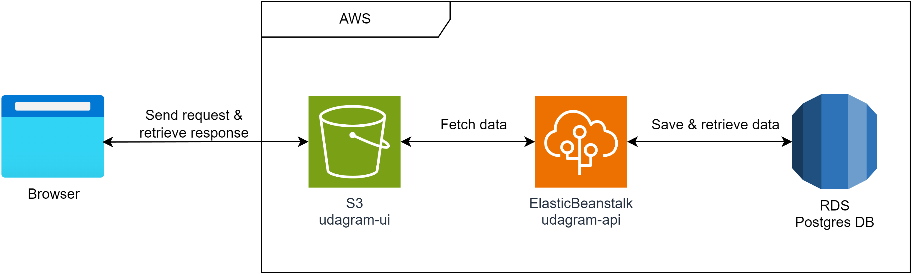

# Infrastructure

### **Relational Database Service**:
- Using RDS to create a Postgres Database for storing user authentication info and image posts.
### **Simple Storage Service**:
- Using S3 bucket to host static udagram frontend application.
### **Elastic Beanstalk**:
- Using Elastic Beanstalk to deploy and hosting udagram api application.
