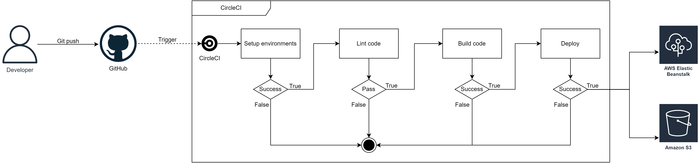

# Infrastructure

### Triggering the Pipeline:

- Developer pushes code to GitHub.
- GitHub webhook notifies CircleCI to start the pipeline.

### Environment Setup and Code Checkout:

- CircleCI sets up the required environment, which includes installing necessary dependencies such as Node.js, AWS CLI, EB CLI, etc.
- Code is checked out from the GitHub repository.

### Linting:

- The pipeline runs a linting process to analyze the source code for programmatic or stylistic errors. This step helps maintain code quality and consistency.

### Building Source Code:

- After successful linting, the source code is built. This step involves compiling and preparing the code for deployment.

### Deployment to AWS:

- The built source code is deployed to AWS services.

### Error Handling:

- If any error occurs during any step in the pipeline, the pipeline is considered failed.
- Failing the pipeline ensures that only code that successfully passes all the defined checks and processes is deployed.
